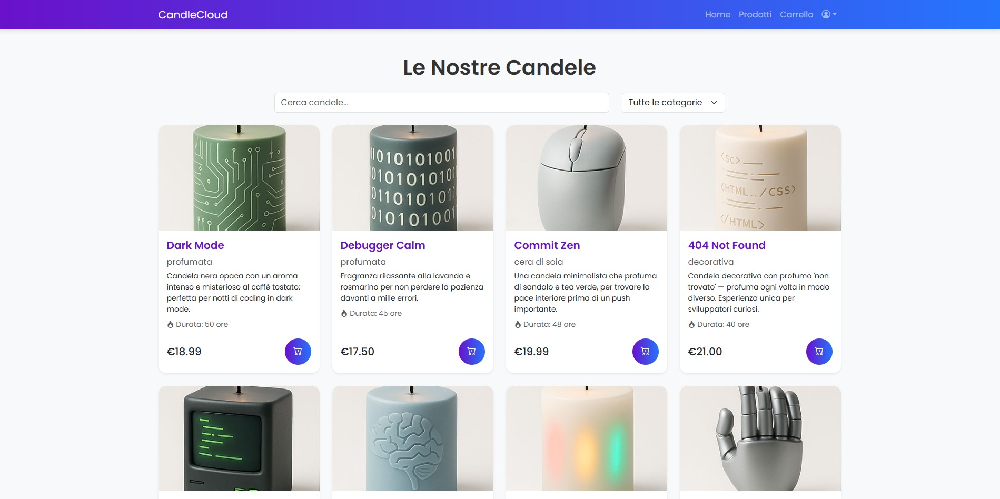

# CandleCloud E-commerce

Progetto universitario per il corso di Fondamenti Web. 



## 📋 Descrizione

CandleCloud è un'e-commerce completa sviluppata con tecnologie moderne per la vendita di candele artigianali. Il progetto include funzionalità di autenticazione utente, gestione carrello, catalogo prodotti e sistema di checkout.

## 🚀 Deployment

L'applicazione è stata deployata utilizzando servizi cloud gratuiti:

- **Live Preview**: [https://e-commerce-web-brown-ten.vercel.app/](https://e-commerce-web-brown-ten.vercel.app/)

## 🛠️ Tecnologie Utilizzate

### Frontend
- **React 18** - Libreria JavaScript per UI
- **React Router** - Navigazione tra pagine
- **Bootstrap 5** - Framework CSS
- **Axios** - Client HTTP per API calls

### Backend
- **Node.js** - Runtime JavaScript
- **Express.js** - Framework web
- **MongoDB** - Database NoSQL
- **Mongoose** - ODM per MongoDB
- **JWT** - Autenticazione e autorizzazione
- **bcryptjs** - Hashing password


## ✨ Funzionalità Implementate

- ✅ **Autenticazione completa** (Registrazione, Login, Logout)
- ✅ **Catalogo prodotti** con ricerca e filtri per categoria
- ✅ **Gestione carrello** (Aggiungi, rimuovi, modifica quantità)
- ✅ **Profilo utente** personalizzato
- ✅ **Design responsive** con Bootstrap
- ✅ **API RESTful** complete
- ✅ **Sicurezza** con JWT e password hashing
- ✅ **Validazione dati** lato client e server

## 🔧 Installazione Locale

### Prerequisiti
- Node.js (versione 16+)
- MongoDB locale o Atlas
- Git

### Clone del repository
```bash
git clone [url-repository]
cd candlecloud
```

### Configurazione Backend
```bash
# Installa dipendenze
npm install

# Configura variabili d'ambiente
# Crea un file .env nella root con:
MONGO_URI=your_mongodb_connection_string
JWT_SECRET=your_jwt_secret_key
NODE_ENV=development
PORT=5001

# Avvia il server backend
npm run dev
```

### Configurazione Frontend
```bash
# In un nuovo terminale, avvia React
npm start
```

L'applicazione sarà disponibile su:
- Frontend: http://localhost:3000
- Backend: http://localhost:5001

## 📱 Screenshots

L'applicazione include:
- Homepage accattivante con hero section
- Pagina prodotti con filtri e ricerca
- Sistema di autenticazione completo
- Carrello funzionale
- Design moderno e responsive

## 🐳 Docker Support

Il progetto include configurazione Docker per deployment containerizzato:

```bash
# Avvia con Docker Compose
docker-compose up --build
```